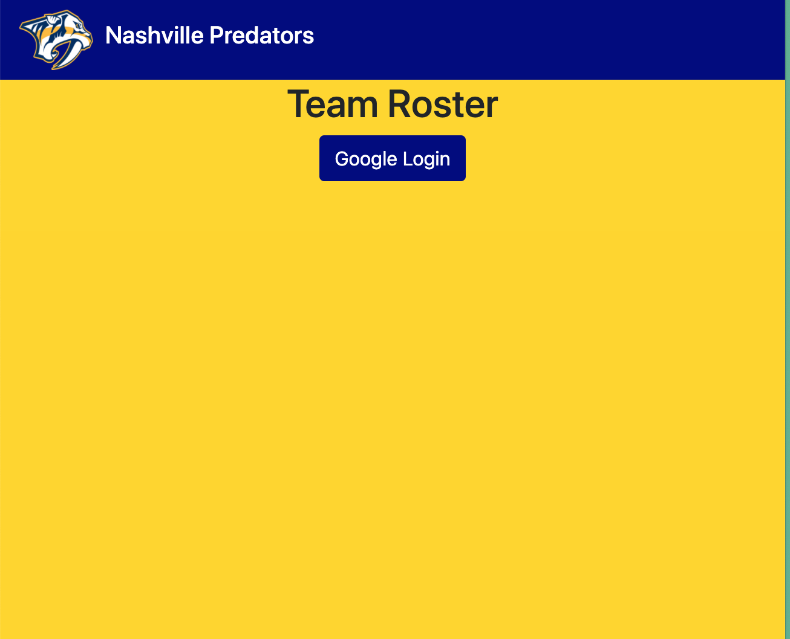
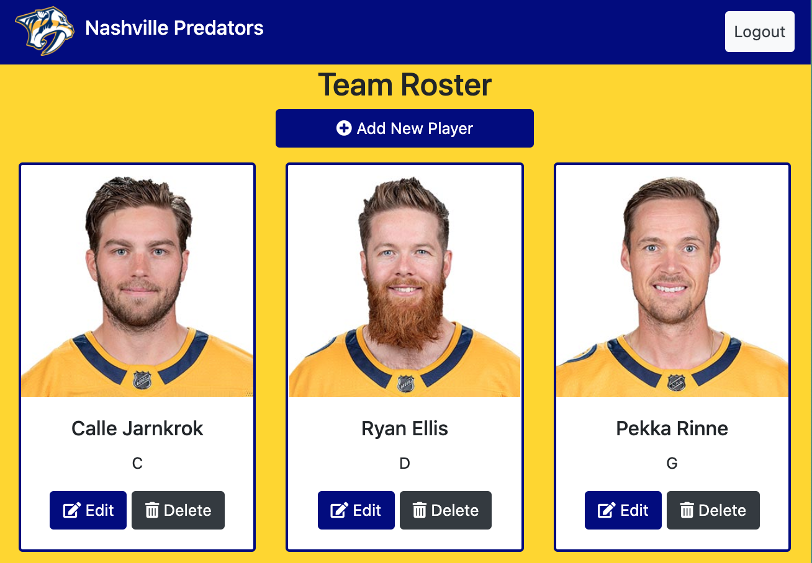
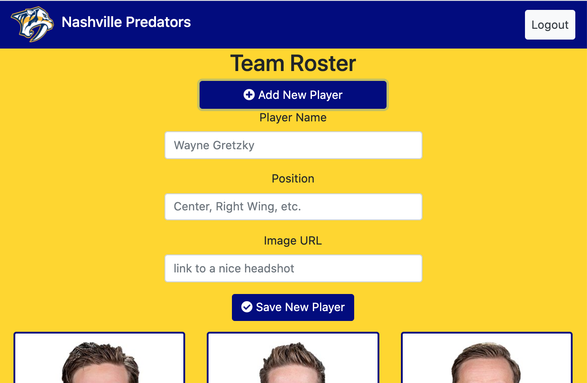

# NSS Exercise: "Sports Roster”

### Technologies Used:
HTML5, SCSS/CSS, React, Firebase

### Description:
NSS homework project which introduces React and JSX, and how to perform full CRUD on React components.

“Design single-page web app to manage the roster of a sports team of your choice.”

#### Exercise Requirements
- User Authentication with Google login via Firebase
- Firebase Database management
- full CRUD capability for each player on the roster

### Screenshots:
#### Landing Page/ User Authentication Point

#### Authenticated User's Roster View

#### Add New Player

### Deployed App:
[Click here to view the deployed web app](https://sports-roster-1f515.firebaseapp.com/)
